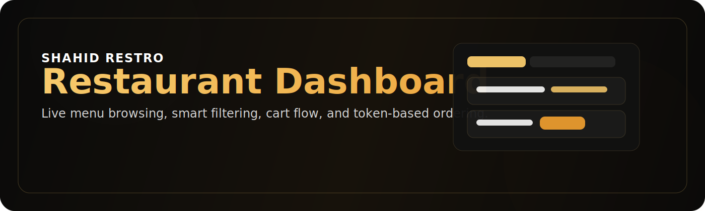
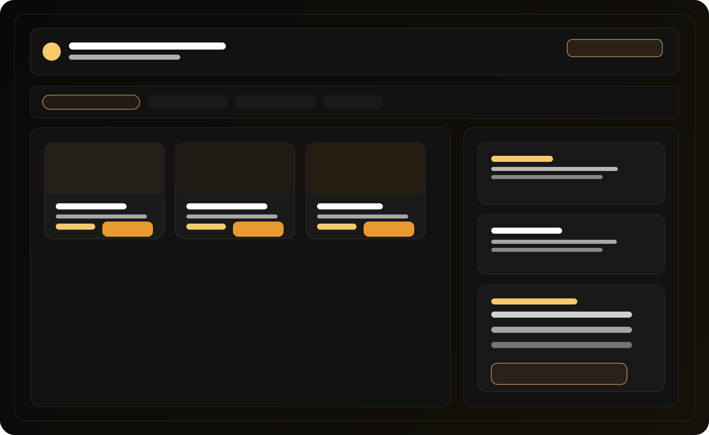
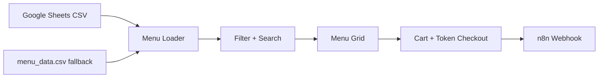

	

<h1 align="center">SHAHID RESTRO</h1>

<strong>Restaurant dashboard with live menu browsing, fast filtering, and token-based ordering</strong>

	
	
	
	

	<a href="#overview">Overview</a> ·
	<a href="#visual-preview">Visual Preview</a> ·
	<a href="#features">Features</a> ·
	<a href="#quick-start">Quick Start</a> ·
	<a href="#project-architecture">Architecture</a> ·
	<a href="#contact">Contact</a>

---

## Overview

SHAHID RESTRO is a modern restaurant dashboard built to make menu browsing and ordering feel fast, clean, and premium. It loads menu data from Google Sheets, supports instant filtering/search, and includes a cart + token flow for order handling.

<table>
	<tr>
		<td width="25%" align="center">
			<strong>🍽 Live Menu</strong> 
			Menu items load dynamically from Google Sheets.
		</td>
		<td width="25%" align="center">
			<strong>🔎 Smart Search</strong> 
			Filter by category or search ingredients quickly.
		</td>
		<td width="25%" align="center">
			<strong>🛒 Cart Flow</strong> 
			Token-based cart summary with tax calculation.
		</td>
		<td width="25%" align="center">
			<strong>💬 Assistant</strong> 
			Chat and order integration through n8n webhook.
		</td>
	</tr>
</table>

## Visual Preview

	

## Features

- ✅ Real-time menu loading from Google Sheets CSV
- ✅ Automatic fallback to local `menu_data.csv` if the sheet is unavailable
- ✅ Category filters and keyword search
- ✅ Menu cards with images and quick add-to-cart action
- ✅ Token-based cart and checkout flow with tax summary
- ✅ Sidebar quick menu and popular-items board for fast navigation
- ✅ Contact modal and in-page feedback form
- ✅ Chat assistant integration via n8n webhook

## Quick Start

1. Clone the repository.
2. Run a local server:
	 - `python launch_server.py`
	 - or `start_website.bat` on Windows
3. Open the local URL shown by the server.

> Tip: running through a server works better than opening `index.html` directly.

## Project Architecture

## Data Source

Primary CSV endpoint:

`https://docs.google.com/spreadsheets/d/19urkakgRjgueR7eyzKnUsOFUXZNOsmDDXAzM0kFvYN8/export?format=csv&id=19urkakgRjgueR7eyzKnUsOFUXZNOsmDDXAzM0kFvYN8&gid=840320789`

Required columns:

- `Item Name`
- `Quantity`
- `Ingredients`
- `Price (INR)`

## Tech Stack

| Layer | Tools |
| --- | --- |
| UI | HTML5, CSS3, Font Awesome |
| Logic | Vanilla JavaScript (ES6+) |
| Typography | Google Fonts: `Manrope`, `Sora` |
| Data | Google Sheets CSV + local fallback |

## Contact

<table>
	<tr>
		<td><strong>👤 Owner</strong></td>
		<td>Shahid Afrid Khan</td>
	</tr>
	<tr>
		<td><strong>📞 Phone</strong></td>
		<td>+91 9392637051</td>
	</tr>
	<tr>
		<td><strong>✉️ Email</strong></td>
		<td>shahidafridkhanphatan@gmail.com</td>
	</tr>
</table>

## Notes

- The app relies on network access for Google Sheets and webhook integrations.
- The README includes embedded SVG visuals under [assets](assets) for a cleaner GitHub presentation.

---

<strong>Built for SHAHID RESTRO</strong>
